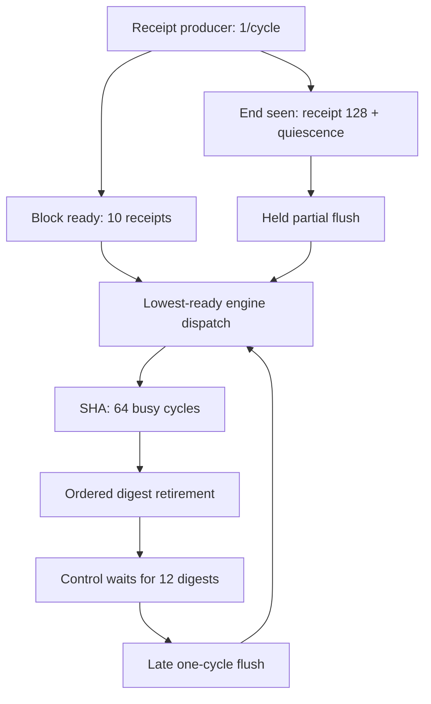

# COSMIC-HW-22: причинный граф перехода во времени

HW-22 изолирует один вопрос: сколько времени теряется не в SHA-256 и не в числе ядер, а в политике завершения потока. RTL остаётся точным blob-к-в-blob наследником HW-21; в A/B-паре меняется только момент и длительность `flush` в testbench.

## Причинный граф



Контроль HW-21 сначала полностью осушает 12 full-digest, и только затем создаёт partial-блок из последних восьми receipts. Интервенция HW-22 доказывает конец producer-потока (`receipt_count=128`, `fill_count=8`, пустой batch, нет pending/valid receipt), сразу поднимает `flush` и держит его до `block_accept` sequence 12.

Удержание обязательно. Однотактный импульс теряется, если на том же фронте `waiting_valid=1`: старый блок может уйти в engine, но flush проверяет старое значение `waiting_valid` и partial-блок не создаётся.

## Формула пространства состояний во времени

Пусть `E` — число SHA engines, `B_j` — готовность блока, `A_j` — его приём engine, `R_j` — retirement digest, а `v_i` — ближайший фронт повторного использования engine `i`.

\[
\begin{aligned}
B_0 &= 12,\quad v_i=0,\quad R_{-1}=0 \\
A_j &= \max(B_j+1,\min_i v_i) \\
R_j &= \max(A_j+65,R_{j-1}+1) \\
B_{j+1} &= \max(B_j+10,A_j),\quad j=0\ldots10
\end{aligned}
\]

Для последнего receipt `P=B_{11}+8`. Контроль создаёт partial-блок в `B_{12}=R_{11}+2`. Ранний held-flush впервые семплируется в `F=P+1` и создаёт partial-блок в `B_{12}=max(F,A_{11}+1)` — второй член сохраняет корректность при занятом waiting slot.

Рекуррентность сворачивается в компактную формулу. При

\[
D(E)=\max(0,65-10E)
\]

получаем:

\[
C_{control}(E)=257+\left\lfloor\frac{11}{E}\right\rfloor D(E)
\]

\[
C_{eager}(E)=198+\left\lfloor\frac{12}{E}\right\rfloor D(E)+[E\le6]
\]

и причинный коэффициент ускорения

\[
G(E)=\frac{C_{control}(E)}{C_{eager}(E)}.
\]

## Предрегистрация до симуляции

| SHA engines | Control, cycles | Eager held, cycles | Снято cycles | Ускорение |
|---:|---:|---:|---:|---:|
| 1 | 862 | 859 | 3 | 1.003× |
| 2 | 482 | 469 | 13 | 1.028× |
| 3 | 362 | 339 | 23 | 1.068× |
| 4 | 307 | 274 | 33 | 1.120× |
| 5 | 287 | 229 | 58 | 1.253× |
| 6 | 262 | 209 | 53 | 1.254× |
| 7 | 257 | 198 | 59 | 1.298× |
| 8 | 257 | 198 | 59 | 1.298× |

Лучший причинный результат модели — `198` cycles при семи engines. Восьмой engine не сокращает время: producer выдаёт один receipt за цикл, full-блок появляется раз в десять циклов, а после семи engines дефицит повторного использования `D(E)` уже равен нулю.

При чисто моделируемых `20.25 MHz` это `9.778 µs/op` или `102.3 kops/s`. Измеренный CPU-reference HW-21 — `5.586 µs/op`; значит, даже после этой оптимизации модель FPGA остаётся примерно в `1.75×` медленнее по latency. Для parity нужно не больше `113` cycles либо подтверждённый физический clock выше примерно `35.45 MHz`.

## Контракт доказательства

Каждый из 16 runs (`E=1..8`, две политики) обязан подтвердить:

- нулевую ошибку относительно предрегистрации;
- 128 receipt handshakes, 13 block accepts и 13 digest handshakes;
- точное совпадение всех 13 SHA-256, а не только последнего;
- последовательности accept/retire `0..12` ровно по одному разу;
- неизменные `13 × 64 = 832` busy-engine cycles;
- ровно одно создание partial-блока;
- отсутствие событий в 16 guard cycles после завершения;
- неизменный exact HEAD/tree на протяжении сбора evidence.

Проверка:

```bash
python -m pytest -q tests/test_cosmic_hw_22_causal_transition.py
python tools/cosmic_hw_22_causal_transition.py \
  --output-dir build/cosmic-hw-22-causal-transition
```

Это причинное утверждение для одной замороженной RTL-симуляции. Синтез, place-and-route, Fmax, плата, power и energy в HW-22 имеют состояние `NOT_RUN`; CPU parity и конкурентное превосходство не заявляются.
